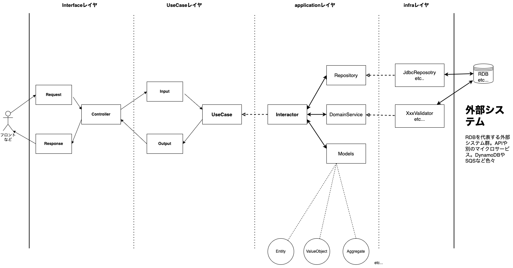

# バックエンドアーキテクチャ

BEのアーキテクチャについて説明する。

## 概要

このアプリケーションはClean Architectureをベースとしたレイヤ構造と、
DDDをベースにした設計になっている。

Clean Architectureとかに慣れていない人でも、アプリケーションアーキテクチャに嫌悪感がない人であれば、
一度実装の流れを掴めば苦もなく順応できるだろう。

このプロジェクトではモジュールでレイヤを分けているが、1モジュールの中でpackageを分け、開発者の努力によって
レイヤを守るようにしても良い。Frameworkの初期状態から、packageを意識的に分けるだけで実現できるので導入の
ハードルが低くなる。

モジュールで分けると、ビルドツールによって依存関係が定義できるので、レイヤ違反を犯しにくくなるメリットがある。

## フロー

このアプリケーションは基本的に下記のようなフローに従って実装されている。
レイヤ構成はClean Architectureの典型的なシナリオを参考にしており、多くの場合に対応でき、
一度慣れればほぼ同じパターンで実装していくことができる。
適切に設計されれば、複雑になりがちなフローの処理の実装は`Interactor`で中心的に扱われる。
つまり、処理の流れは `Interactor` さえ追えば分かるようになる。
また、後述するが、`Output` の実装の仕方によって、`UseCase` が起こしうる検査例外はその `UseCase` の `Output`
だけ見れば分かるようになっている。

流れもシンプルで例外なくこの流れで実装すれば（冗長になることは多々あれど）不用意に複雑になりすぎることは少ない。
※実際には単純な処理では `UseCase` を挟むと冗長になりすぎるので挟まないケースはまあまああるが、複数人で開発していると、
メンバーにはその判断が難しいと感じられてしまう場面が出てくるので、冗長でも全て `UseCase-Interactor` を実装する形式
も開発者を混乱させないというメリットがあるかもしれないと思っている。

実際に、いくつかのプロジェクトで、この構造を説明し導入したところ、プロジェクトのメンバーは割と早い段階で順応してくれた。

### 各要素の説明

- [Request](types/Request.md)
- [Response](types/Response.md)
- [Controller](types/Controller.md)
- [Input](types/Input.md)
- [Output](types/Output.md)
- [UseCase](types/UseCase.md)
- [Interactor](types/Interactor.md)
- [Repository](types/Repository.md)
- [DomainService](types/DomainService.md)
- [Entity](types/Entity.md)
- [ValueObject](types/ValueObject.md)
- [Aggregate](types/Aggregate.md)
- [JdbcRepository, XxxValidator etc...](types/impl.md)

#### Output

#### UseCase

#### Interactor

#### Repository, DomainService, Models

#### JdbcRepository, XxxValidator, etc...

## 基本的な実装の流れ

## DDDの実装